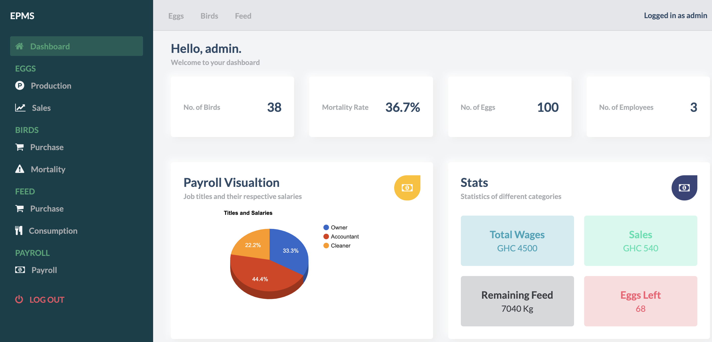

# EPMS

EPMS is a management system developed for a startup poultry farm business called Eggcellent Palace. It was developed as a final course project of Ashesi University's Web Technologies class. EPMS's objective is to keep track of all transactions and activities involved in a poultry farm. These activities include egg sales, feed consumption tracking, managing the number of eggs in stock, the number of birds in the farm, flock production and finally keeping the salary records of the employees who work on the farm. So, the activities are grouped into the following categories:
* Eggs (keeping track of total eggs)
* Birds(keeping track of their quantity and mortality)
* Feed (costs and quantity consumed)
* Employees(keeping track of salary records)
* Sales (keeping track of sales record)

## Technologies Used

1. HTML
2. CSS
4. JavaScript
5. PHP
6. MySQL

## Implemented Functionalities

* Admin can create, view, edit, and delete payroll records
* Admin can create, view, edit, and delete records of eggs sold and eggs produced
* Admin can create, view, edit, and delete records of birds purchased and birds dead
* Admin can create, view, edit, and delete records of feed consumption and purchase
* Admin can view the stock summary 

## Running EPMS Locally
The following steps go through how you can run EPMS management system in your local environment. Assuming you have some kind of local server like XAMPP installed on your machine, just follow the steps below.
1. cd into htdocs (For Mac users you can run the following command from anywhere in your terminal: cd ~/.bitnami/stackman/machines/xampp/volumes/root/htdocs)
2. Once in htdocs folder, clone this repository and git it a name of your choice. For instance the following command would create a folder called **epmsproject** inside htdocs folder with the project files: git clone https://github.com/ChuckyCharles/epms_cloud.git epmsproject
3. With that out of the way, cd into epmsproject folder and navigate to sql folder to get the sql file to be imported in PHPMyAdmin 
4. Then navigate to includes sub-directory in **epmsproject** directory and open **database.php** file and change the database credenials according to your database. 
5. Finally, you can run the project in your browser by writing localhost:8080/epms or any port you have. This would take you to the homepage of the EPMS application.
6. Congratulations! You have successfully managed to run EPMS web application. Have fun!

